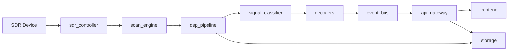

# 4ham-spectrum-analysis
Automatic radio spectrum analyzer for amateur radio bands

## Objetivo
Projeto web-based para varrer bandas de radioamador, detetar ocupacao de frequencias e identificar sinais, incluindo modos digitais e CW.
Deve correr em Raspberry Pi e PC (Linux/Windows), com interface moderna e multi-idioma (pt/en/es).

## Requisitos principais
- Hardware: RTL-SDR (principal), preparado para HackRF, Airspy e transceiver com interface SDR.
- Varrimento de banda com deteccao de ocupacao (power/threshold adaptativo).
- Waterfall em tempo real e historico.
- Identificacao automatica de indicativos em FT8/FT4, APRS, CW e SSB (voz).
- UI web moderna, limpa e responsiva.
- Idiomas: Portugues, Ingles, Espanhol (selecionado na instalacao).

## Bandas alvo
- 2 m
- 70 cm
- 10 m
- 12 m
- 15 m
- 17 m
- 20 m
- 40 m
- 80 m
- 160 m

## Bandas alvo (IARU Regiao 1 - limites de banda)
- 160 m: 1.810 - 2.000 MHz
- 80 m: 3.500 - 3.800 MHz
- 40 m: 7.000 - 7.200 MHz
- 20 m: 14.000 - 14.350 MHz
- 17 m: 18.068 - 18.168 MHz
- 15 m: 21.000 - 21.450 MHz
- 12 m: 24.890 - 24.990 MHz
- 10 m: 28.000 - 29.700 MHz
- 2 m: 144 - 146 MHz
- 70 cm: 430 - 440 MHz

Nota: os limites podem variar por regulacao nacional; o plano deve suportar perfis por pais.
Perfil regional de exemplo: ver [config/region_profile_example.yaml](config/region_profile_example.yaml).
Schema do perfil regional: ver [config/region_profile.schema.json](config/region_profile.schema.json).

## Arquitetura (alto nivel)
1. **Camada SDR**
	- Controle do dispositivo (tuning, ganho, sample rate).
	- Abstracao por driver (SoapySDR ou backends nativos).
2. **Camada DSP**
	- FFT, windowing, noise floor, detecao de picos.
	- Estimativa de largura de banda e ocupacao.
3. **Camada de identificacao**
	- Classificacao de modos (AM/FM/SSB/FSK/PSK).
	- Decodificacao digital (ex.: FT8/FT4, APRS) e CW.
4. **Backend API**
	- REST + WebSocket para streaming do espectro e eventos.
5. **Frontend Web**
	- Waterfall em tempo real, controlos de scan, logs, exportacao.
6. **Persistencia**
	- SQLite para historico, eventos e configuracoes.

## Stack sugerida
- **Backend/DSP**: Python + GNU Radio + SoapySDR + NumPy/SciPy.
- **API**: FastAPI (REST + WebSocket).
- **Frontend**: React + Vite + TypeScript, WebGL para waterfall.
- **Storage**: SQLite + ficheiros para exportacao (CSV/PNG/JSON).

Backend skeleton: ver [backend/app/main.py](backend/app/main.py).
Frontend skeleton: ver [frontend/index.html](frontend/index.html).

## Fluxo de dados
1. SDR capta IQ por segmentos de frequencia (scan).
2. DSP gera FFT e energia por bin.
3. Deteccao de ocupacao aplica threshold adaptativo.
4. Resultados e waterfall enviados por WebSocket.
5. UI atualiza em tempo real e grava historico.

## Modulos sugeridos
- `sdr_controller`: descoberta de hardware, tuning, ganho.
- `scan_engine`: varrimento por banda (step/dwell).
- `dsp_pipeline`: FFT, deteccao de picos, ocupacao.
- `signal_classifier`: heuristicas de modos.
- `digital_decoder`: integracao com decoders digitais.
- `cw_decoder`: detecao e decodificacao CW.
- `api_gateway`: REST + WebSocket.
- `ui`: waterfall, controlos, logs.
- `storage`: eventos e historico.

## Identificacao de indicativos (design)
- FT8/FT4: integracao via WSJT-X (UDP/arquivos de decoded), extrair callsigns e SNR.
- APRS: Direwolf como TNC, leitura via KISS TCP/AGW, extrair callsigns e mensagens.
- CW: detecao de tom, binarizacao adaptativa, decoder Morse, correcao de timing.
- SSB (voz): VAD + ASR para sugerir callsigns (pipeline complexo, baixa confianca).

## Pipelines tecnicos por decoder
### FT8 / FT4 (WSJT-X)
1. Captura IQ e sintonizacao no segmento FT8/FT4 da banda.
2. Downconvert + filtros de banda + ajuste de ganho.
3. Encaminhar audio para WSJT-X (via sound device virtual ou arquivo).
4. Ler saida de decodes via UDP/arquivos (ALL.TXT/decoded). 
5. Normalizar chamadas, SNR, DF, tempo e frequencia.
6. Emitir eventos de identificacao com confianca alta.

### APRS (Direwolf)
1. Captura IQ e sintonizacao na frequencia APRS (ex.: 144.800 MHz na Regiao 1).
2. Demodulacao FM e filtro audio (AFSK 1200).
3. Encaminhar audio para Direwolf (virtual audio ou stdin).
4. Ler frames via KISS TCP/AGW.
5. Parse AX.25: callsign, path, payload, posicao.
6. Emitir eventos APRS e anexar mensagens/telemetria.

### CW (Morse)
1. Captura IQ e detecao de pico estreito (portadora CW).
2. Demodulacao (BFO) e filtro passa-banda estreito.
3. Envelope + binarizacao adaptativa (AGC + threshold).
4. Detecao de dits/dahs com estimativa de WPM.
5. Decoder Morse com correcao de timing.
6. Emitir eventos de callsign com confianca media.

### SSB (voz)
1. Captura IQ e detecao de ocupacao em largura tipica SSB.
2. Demodulacao SSB (USB/LSB) e filtro de voz.
3. VAD (voice activity detection) para segmentos.
4. ASR com vocabulario de chamadas e alfabeto fonetico.
5. Normalizar callsign, score/confidence.
6. Emitir eventos com confianca baixa/media.

## Pipeline ASR para SSB (detalhado)
1. **Pre-processamento audio**: 3 kHz BW, normalizacao de nivel, denoise leve.
2. **VAD**: segmentacao da fala (ex.: WebRTC VAD) para reduzir custo.
3. **ASR leve**: modelo pequeno para edge (ex.: Vosk/Kaldi) ou Whisper tiny/base em PC.
4. **Vocabulario controlado**:
	- Callsigns (regex e dicionario dinâmico por pais).
	- Alfabeto fonetico (NATO/ICAO) e numeros.
	- Palavras comuns em chamadas (CQ, QRZ, de, portable, mobile).
5. **Pos-processamento**:
	- Parse de sequencias foneticas (ex.: "Charlie Tango One" -> CT1).
	- Validacao com regex de callsign (IARU/pais).
	- Score final combinado (ASR confidence + consistencia regex).
6. **Emissao de evento**:
	- `callsign` com `confidence` baixa/media.
	- `raw` com transcricao original.

Nota: a precisao varia muito com ruido e sotaque; tratar ASR como sugestao.

## ASR: modelos recomendados por hardware
- **Raspberry Pi 4 (4 GB)**: Vosk (pt/en/es) com modelos pequenos; latencia moderada.
- **Raspberry Pi 5 (8 GB)**: Vosk + gramaticas; Whisper tiny com cargas leves.
- **PC dual-core**: Whisper base/small ou Vosk grande.
- **PC com GPU**: Whisper medium/large, melhor para ruido e sotaques.

Nota: usar vocabulario controlado e rescoring melhora taxa de acerto em callsigns.

## Callsigns: regex e normalizacao (baseline)
- **Regex global (simplificado)**: `\b[A-Z]{1,3}\d{1,4}[A-Z]{1,3}(/P|/M|/MM|/QRP|/QRPP)?\b`
- **Normalizacao**:
	- Uppercase.
	- Remover separadores e ruido (ex.: "CT 1 ABC" -> CT1ABC).
	- Mapear fonetico para letras (ex.: "Charlie Tango One" -> CT1).
	- Preservar sufixos operacionais (/P, /M, /MM, /QRP).
- **Validacao regional**:
	- Tabela por pais (prefixos e formatos) para reduzir falsos positivos.
	- Perfil IARU Regiao 1 por defeito.

Nota: formatos variam por pais; criar tabelas de prefixos por regulador nacional.

## Diagrama (componentes e fluxo)
SDR (RTL-SDR/HackRF/Airspy/Transceiver)
	-> sdr_controller
	-> scan_engine
	-> dsp_pipeline (FFT/ocupacao)
	-> signal_classifier
	-> decoders (FT8/FT4 | APRS | CW | SSB)
	-> event_bus
	-> api_gateway (REST/WS)
	-> frontend (waterfall/UI)
	-> storage (SQLite/exports)

### Mermaid


## Formato de eventos/telemetria
Schema JSON: ver [events.schema.json](events.schema.json).
Contrato por modo: ver [docs/events_contract.md](docs/events_contract.md).

### Evento base
```json
{
	"type": "occupancy|callsign",
	"timestamp": "2026-02-20T12:34:56Z",
	"band": "20m",
	"frequency_hz": 14074000,
	"mode": "FT8|FT4|APRS|CW|SSB|Unknown",
	"snr_db": -12.5,
	"confidence": 0.0,
	"source": "wsjtx|direwolf|cw|asr|dsp",
	"device": "rtl_sdr"
}
```

### Evento de ocupacao
```json
{
	"type": "occupancy",
	"timestamp": "2026-02-20T12:34:56Z",
	"band": "40m",
	"frequency_hz": 7074000,
	"bandwidth_hz": 2700,
	"power_dbm": -92.3,
	"snr_db": 6.1,
	"threshold_dbm": -98.0,
	"occupied": true,
	"mode": "SSB",
	"confidence": 0.62,
	"device": "rtl_sdr"
}
```

### Evento de identificacao (callsign)
```json
{
	"type": "callsign",
	"timestamp": "2026-02-20T12:34:56Z",
	"band": "20m",
	"frequency_hz": 14074000,
	"mode": "FT8",
	"callsign": "CT1ABC",
	"snr_db": -12.5,
	"df_hz": 42,
	"confidence": 0.94,
	"raw": "CT1ABC EA1XYZ IO81",
	"source": "wsjtx",
	"device": "rtl_sdr"
}
```

## Contrato API (REST/WS)
### REST (JSON)
- `GET /api/health`: status do servico e dispositivos.
- `GET /api/devices`: lista de SDR disponiveis.
- `POST /api/scan/start`: iniciar scan (payload com banda, step, dwell, modo).
- `POST /api/scan/stop`: parar scan.
- `GET /api/bands`: bandas e limites configurados.
- `GET /api/events`: historico filtrado (time range, banda, modo, callsign).
- `GET /api/exports/{id}`: download de CSV/JSON/PNG.

### WebSocket
- `WS /ws/spectrum`: stream de FFT/waterfall (frames agregados).
- `WS /ws/events`: eventos de ocupacao e indicativos em tempo real.
- `WS /ws/status`: estado do scan e estatisticas de processamento.

### Payloads principais
Schema do scan: ver [config/scan_config.schema.json](config/scan_config.schema.json).
```json
{
	"scan": {
		"band": "20m",
		"start_hz": 14000000,
		"end_hz": 14350000,
		"step_hz": 2000,
		"dwell_ms": 250,
		"mode": "auto"
	}
}
```

```json
{
	"spectrum_frame": {
		"timestamp": "2026-02-20T12:34:56Z",
		"center_hz": 14074000,
		"span_hz": 3000,
		"fft_db": [-120.1, -118.2, -116.7],
		"bin_hz": 3.9
	}
}
```

```json
{
	"status": {
		"state": "running",
		"device": "rtl_sdr",
		"cpu_pct": 62.5,
		"drop_rate_pct": 0.4
	}
}
```

## WebSocket: detalhes de frames e taxas
Especificacao detalhada: ver [docs/websocket_spec.md](docs/websocket_spec.md).
- `WS /ws/spectrum`: envia frames agregados (ex.: 10 a 20 FFT por mensagem).
- `spectrum_frame` suporta compressao opcional (delta + int8) para Raspberry Pi.
- Taxas sugeridas:
  - Waterfall: 5 a 15 fps (ajustavel).
  - Eventos: em tempo real (latencia < 500 ms).
  - Status: 1 a 2 Hz.

### Frame comprimido (exemplo)
```json
{
	"spectrum_frame": {
		"timestamp": "2026-02-20T12:34:56Z",
		"center_hz": 7074000,
		"span_hz": 3000,
		"bin_hz": 3.9,
		"encoding": "delta_int8",
		"fft_ref_db": -120.0,
		"fft_delta": [0, 1, 0, -1]
	}
}
```

## Integracao de decoders (configuracao minima)
### WSJT-X (FT8/FT4)
- Usar audio virtual (Linux: ALSA loopback/Pulse; Windows: VB-Cable).
- Ativar envio UDP de decodes (porta configuravel).
- Ler arquivos `ALL.TXT` e `decoded` como fallback.
- Sincronizar tempo (NTP) para evitar perda de decodes.

### Direwolf (APRS)
- Demodulacao FM -> audio 1200 AFSK.
- Direwolf em modo KISS TCP (porta configuravel).
- Parse de frames AX.25 com validacao de CRC.
- Frequencia APRS Regiao 1: 144.800 MHz (configuravel por pais).

## Roadmap (sugestao)
1. MVP: scan + ocupacao + waterfall + exportacao.
2. Identificacao de modos analogicos.
3. Decodificacao digital (FT8/FT4/APRS) e CW.
4. Alertas e analitica de ocupacao.

## Notas de performance
- Raspberry Pi: limitar sample rate, FFT em lotes, WebGL para render.
- Compressao/downsamping para streaming eficiente.

## Requisitos de recursos (estimativa)
Detalhes de hardware e performance: ver [docs/hardware_requirements.md](docs/hardware_requirements.md).
- **Raspberry Pi 4 (4 GB)**: FT8/FT4 + APRS + CW simultaneo; SSB/ASR limitado.
- **Raspberry Pi 5 (8 GB)**: SSB/ASR leve, melhor para scan rapido.
- **PC dual-core**: todos os decoders com taxa moderada.

Nota: ASR em SSB exige CPU/GPU mais forte; recomendado opcional.

## Next steps
- Mapear frequencias exatas por banda e regioes (IARU).
- Selecionar decoders digitais a integrar (FT8/FT4/APRS/CW).
- Detalhar configuracoes por hardware (RTL-SDR/HackRF/Airspy/transceiver).
- Definir o contrato final do WebSocket e formatos de frame.
- Backlog tecnico: ver [docs/backlog.md](docs/backlog.md).
- Instalacao: ver [docs/install.md](docs/install.md).
- SQLite schema: ver [docs/sqlite_schema.sql](docs/sqlite_schema.sql).
- Validacao de prefixos: ver [docs/prefix_validation.md](docs/prefix_validation.md).
- Testes basicos DSP: ver [backend/tests/test_dsp.py](backend/tests/test_dsp.py).
- Runner de desenvolvimento: ver [scripts/run_dev.sh](scripts/run_dev.sh).
- Runner Windows: ver [scripts/run_dev.ps1](scripts/run_dev.ps1).
