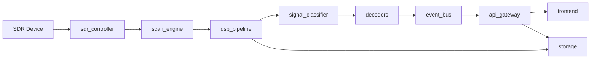

<!--
© 2026 Octávio Filipe Gonçalves
Callsign: CT7BFV
License: GNU AGPL-3.0 (https://www.gnu.org/licenses/agpl-3.0.html)
Last update: 2026-02-22 16:27:19 UTC
-->

# 4ham-spectrum-analysis
Web platform for amateur radio spectrum analysis, with DSP, real-time events, and decoder integration.

## Goal
Web-based project to scan amateur radio bands, detect frequency occupancy, and identify signals, including digital modes and CW.
It is designed to run on Raspberry Pi and PC (Linux/Windows), with a modern multilingual interface (pt/en/es).

## Main requirements
- Hardware: RTL-SDR (primary), with readiness for HackRF, Airspy, and transceivers with SDR interface.
- Band scanning with occupancy detection (adaptive power/threshold).
- Real-time waterfall and history.
- Automatic callsign identification for FT8/FT4, APRS, CW, and SSB (voice).
- Modern, clean, and responsive web UI.
- Languages: Portuguese, English, Spanish (selected during installation).

Note: installation instructions are in [docs/install.md](docs/install.md), including SoapySDR via `apt` on Linux. Full manual in [docs/installation_manual.md](docs/installation_manual.md).

## Quick Start (3 minutes)
Run from the repository root.

1) Create and activate a virtual environment:
```bash
python3 -m venv .venv
source .venv/bin/activate
```

2) Install backend dependencies:
```bash
python -m pip install -r backend/requirements.txt
```

3) Start backend + UI (same-origin):
```bash
python -m uvicorn app.main:app --app-dir backend --host 127.0.0.1 --port 8000
```

4) Open the app and verify health:
- UI: `http://127.0.0.1:8000/`
- API health: `http://127.0.0.1:8000/api/health`

5) Optional smoke test (start/stop scan):
```bash
curl -X POST http://127.0.0.1:8000/api/scan/start \
	-H "Content-Type: application/json" \
	-d '{"scan":{"band":"20m","start_hz":14000000,"end_hz":14002000,"step_hz":1000,"dwell_ms":200,"mode":"auto","sample_rate":48000,"center_hz":14001000}}'

curl -X POST http://127.0.0.1:8000/api/scan/stop
```

For full platform-specific installation and decoder setup, see [docs/installation_manual.md](docs/installation_manual.md).

## Changelog (cumulative)

### v0.5.0
- Complete CW Morse decoder in pure Python (Butterworth filter, Hilbert envelope, auto-threshold, timing analysis, Morse table lookup).
- CWSweepDecoder for FFT-guided band sweep with configurable step/dwell.
- CW decoder integrated into API with auto-start, mutual exclusion with FT decoders.
- CW sweep controls in frontend scan panel; CW markers on waterfall.
- RTL-SDR V4 detection and HF handling (R828D upconverter, no direct sampling).
- WSPR dial frequencies corrected for IARU Region 1; WSPR OOM and mid-scan abort fixes.
- Improved UI layout: larger VFO, status in VFO bar, vibrant band lines, fixed layout shifts.
- Propagation map polish: drag speed reduced, globe fills card, larger control buttons.
- Preview scan bounds configurable via env vars; stale bounds cleared on stop.
- Added scipy to requirements.txt.

### v0.2.6
- Added waterfall mode-label hover tooltip with frequency, latest callsign, last-seen time, and SNR.
- Callsign in tooltip is resolved by nearest frequency match in cache; when no local match exists, it falls back to the most recent detected callsign.
- Improved operator feedback with immediate custom tooltip rendering on hover.

### v0.2.5
- Removed Fake waterfall mode from the UI and runtime flow; waterfall now runs in LIVE mode only.
- Replaced simulated waterfall fallback with a clear generic status message when live spectrum frames are unavailable.
- Improved waterfall no-data communication with a larger, centered, high-visibility message for operators.

### v0.2.4
- Added quick band switching row near Start scanning for faster operator workflow.
- Implemented live band switching with automatic stop/start while scan is running.
- Improved scan startup resilience with sample-rate safeguards and clearer error behavior.
- Added operational tooling with `run_dev.sh` (`start|stop|logs|status`).
- Added production `systemd` packaging tooling and service management scripts.

### v0.2.3
- Refined Administration UX for device/audio setup workflows.
- Improved reliability when auto-detect fills and persists device configuration fields.
- Added dedicated save actions in Administration for device and audio configuration blocks.
- Removed duplicated audio status messaging in the Audio Configuration area.

### v0.2.2
- Added global fullscreen toggle for waterfall visualization.
- Improved fullscreen button label behavior for clearer UI state.

### v0.2.1
- Added LIVE/FAKE waterfall mode badge and improved decoder status hints.
- Improved events rendering to better infer and present band/mode details.
- Added richer SSB event enrichment and grid/report display consistency.

Releases: [v0.2.1](https://github.com/octaviofilipepereira/4ham-spectrum-analysis/releases/tag/v0.2.1), [v0.2.2](https://github.com/octaviofilipepereira/4ham-spectrum-analysis/releases/tag/v0.2.2), [v0.2.3](https://github.com/octaviofilipepereira/4ham-spectrum-analysis/releases/tag/v0.2.3), [v0.2.4](https://github.com/octaviofilipepereira/4ham-spectrum-analysis/releases/tag/v0.2.4)

## Target bands
- 2 m
- 70 cm
- 10 m
- 12 m
- 15 m
- 17 m
- 20 m
- 40 m
- 80 m
- 160 m

## Target bands (IARU Region 1 - band limits)
- 160 m: 1.810 - 2.000 MHz
- 80 m: 3.500 - 3.800 MHz
- 40 m: 7.000 - 7.200 MHz
- 20 m: 14.000 - 14.350 MHz
- 17 m: 18.068 - 18.168 MHz
- 15 m: 21.000 - 21.450 MHz
- 12 m: 24.890 - 24.990 MHz
- 10 m: 28.000 - 29.700 MHz
- 2 m: 144 - 146 MHz
- 70 cm: 430 - 440 MHz

Note: limits may vary by national regulation; the plan supports per-country profiles.
Regional profile example: see [config/region_profile_example.yaml](config/region_profile_example.yaml).
Regional profile schema: see [config/region_profile.schema.json](config/region_profile.schema.json).

## Architecture (high level)
1. **SDR Layer**
	- Device control (tuning, gain, sample rate).
	- Driver abstraction (SoapySDR or native backends).
2. **DSP Layer**
	- FFT, windowing, noise floor, peak detection.
	- Bandwidth and occupancy estimation.
3. **Identification Layer**
	- Mode classification (AM/FM/SSB/FSK/PSK).
	- Digital decoding (e.g., FT8/FT4, APRS) and CW.
4. **Backend API**
	- REST + WebSocket for spectrum and event streaming.
5. **Web Frontend**
	- Real-time waterfall, scan controls, logs, export.
6. **Persistence**
	- SQLite for history, events, and settings.

## Suggested stack
- **Backend/DSP**: Python + GNU Radio + SoapySDR + NumPy/SciPy.
- **API**: FastAPI (REST + WebSocket).
- **Frontend**: React + Vite + TypeScript, WebGL for waterfall.
- **Storage**: SQLite + files for export (CSV/PNG/JSON).

Backend skeleton: see [backend/app/main.py](backend/app/main.py).
Frontend skeleton: see [frontend/index.html](frontend/index.html).

## Data flow
1. SDR captures IQ by frequency segments (scan).
2. DSP generates FFT and per-bin energy.
3. Occupancy detection applies adaptive threshold.
4. Results and waterfall are sent over WebSocket.
5. UI updates in real time and stores history.

## Suggested modules
- `sdr_controller`: hardware discovery, tuning, gain.
- `scan_engine`: per-band scanning (step/dwell).
- `dsp_pipeline`: FFT, peak detection, occupancy.
- `signal_classifier`: mode heuristics.
- `digital_decoder`: integration with digital decoders.
- `cw_decoder`: CW detection and decoding.
- `api_gateway`: REST + WebSocket.
- `ui`: waterfall, controls, logs.
- `storage`: events and history.

## Callsign identification (design)
- FT8/FT4: integration via WSJT-X (UDP/decoded files), extract callsigns and SNR.
- APRS: Direwolf as TNC, read via KISS TCP/AGW, extract callsigns and messages.
- CW: tone detection, adaptive binarization, Morse decoder, timing correction.
- SSB (voice): VAD + ASR to suggest callsigns (complex pipeline, lower confidence).

Note: backend supports automated file ingestion (ALL.TXT/logs) via environment variables; see the full manual.

## Technical decoder pipelines
### FT8 / FT4 (WSJT-X)
1. Capture IQ and tune to the FT8/FT4 segment of the band.
2. Downconvert + band filters + gain adjustment.
3. Route audio to WSJT-X (virtual sound device or file).
4. Read decoded output via UDP/files (ALL.TXT/decoded).
5. Normalize callsigns, SNR, DF, time, and frequency.
6. Emit identification events with high confidence.

### APRS (Direwolf)
1. Capture IQ and tune to APRS frequency (e.g., 144.800 MHz in Region 1).
2. FM demodulation and audio filtering (AFSK 1200).
3. Route audio to Direwolf (virtual audio or stdin).
4. Read frames via KISS TCP/AGW.
5. Parse AX.25: callsign, path, payload, position.
6. Emit APRS events and attach messages/telemetry.

### CW (Morse)
1. Capture IQ and detect narrow peak (CW carrier).
2. Demodulation (BFO) and narrow band-pass filter.
3. Envelope + adaptive binarization (AGC + threshold).
4. Dit/dah detection with WPM estimation.
5. Morse decoder with timing correction.
6. Emit callsign events with medium confidence.

### SSB (voice)
1. Capture IQ and detect occupancy in typical SSB bandwidth.
2. SSB demodulation (USB/LSB) and voice filtering.
3. VAD (voice activity detection) for segmentation.
4. ASR with callsign vocabulary and phonetic alphabet.
5. Normalize callsign, score/confidence.
6. Emit events with low/medium confidence.

## ASR pipeline for SSB (detailed)
1. **Audio pre-processing**: 3 kHz BW, level normalization, light denoise.
2. **VAD**: speech segmentation (e.g., WebRTC VAD) to reduce cost.
3. **Light ASR**: edge-friendly model (e.g., Vosk/Kaldi) or Whisper tiny/base on PC.
4. **Controlled vocabulary**:
	- Callsigns (regex and dynamic per-country dictionary).
	- Phonetic alphabet (NATO/ICAO) and numbers.
	- Common calling words (CQ, QRZ, de, portable, mobile).
5. **Post-processing**:
	- Parse phonetic sequences (e.g., "Charlie Tango One" -> CT1).
	- Validate with callsign regex (IARU/country).
	- Combined final score (ASR confidence + regex consistency).
6. **Event emission**:
	- `callsign` with low/medium `confidence`.
	- `raw` with original transcript.

Note: accuracy varies significantly with noise and accent; treat ASR as a suggestion.

## ASR: recommended models by hardware
- **Raspberry Pi 4 (4 GB)**: Vosk (pt/en/es) with small models; moderate latency.
- **Raspberry Pi 5 (8 GB)**: Vosk + grammars; Whisper tiny with light workloads.
- **Dual-core PC**: Whisper base/small or larger Vosk models.
- **GPU PC**: Whisper medium/large, better for noise and accents.

Note: controlled vocabulary and rescoring improve callsign hit rate.

## Callsigns: regex and normalization (baseline)
- **Global regex (simplified)**: `\b[A-Z]{1,3}\d{1,4}[A-Z]{1,3}(/P|/M|/MM|/QRP|/QRPP)?\b`
- **Normalization**:
	- Uppercase.
	- Remove separators/noise (e.g., "CT 1 ABC" -> CT1ABC).
	- Map phonetics to letters (e.g., "Charlie Tango One" -> CT1).
	- Preserve operational suffixes (/P, /M, /MM, /QRP).
- **Regional validation**:
	- Per-country table (prefixes and formats) to reduce false positives.
	- IARU Region 1 as default profile.

Note: formats vary by country; create prefix tables per national regulator.

## Diagram (components and flow)
SDR (RTL-SDR/HackRF/Airspy/Transceiver)
	-> sdr_controller
	-> scan_engine
	-> dsp_pipeline (FFT/occupancy)
	-> signal_classifier
	-> decoders (FT8/FT4 | APRS | CW | SSB)
	-> event_bus
	-> api_gateway (REST/WS)
	-> frontend (waterfall/UI)
	-> storage (SQLite/exports)

### Mermaid


## Event/telemetry format
JSON schema: see [events.schema.json](events.schema.json).
Per-mode contract: see [docs/events_contract.md](docs/events_contract.md).

### Base event
```json
{
	"type": "occupancy|callsign",
	"timestamp": "2026-02-20T12:34:56Z",
	"band": "20m",
	"frequency_hz": 14074000,
	"mode": "FT8|FT4|APRS|CW|SSB|Unknown",
	"snr_db": -12.5,
	"confidence": 0.0,
	"source": "wsjtx|direwolf|cw|asr|dsp",
	"device": "rtl_sdr"
}
```

### Occupancy event
```json
{
	"type": "occupancy",
	"timestamp": "2026-02-20T12:34:56Z",
	"band": "40m",
	"frequency_hz": 7074000,
	"bandwidth_hz": 2700,
	"power_dbm": -92.3,
	"snr_db": 6.1,
	"threshold_dbm": -98.0,
	"occupied": true,
	"mode": "SSB",
	"confidence": 0.62,
	"device": "rtl_sdr"
}
```

### Identification event (callsign)
```json
{
	"type": "callsign",
	"timestamp": "2026-02-20T12:34:56Z",
	"band": "20m",
	"frequency_hz": 14074000,
	"mode": "FT8",
	"callsign": "CT1ABC",
	"snr_db": -12.5,
	"df_hz": 42,
	"confidence": 0.94,
	"raw": "CT1ABC EA1XYZ IO81",
	"source": "wsjtx",
	"device": "rtl_sdr"
}
```

## API contract (REST/WS)
### REST (JSON)
- `GET /api/health`: service and device status.
- `GET /api/devices`: list of available SDR devices.
- `POST /api/scan/start`: start scan (inline `scan` payload or `scan_config_path` for YAML/JSON; optional `region_profile_path` to resolve per-band limits).
- `POST /api/scan/stop`: stop scan.
- `GET /api/bands`: configured bands and limits.
- `GET /api/events`: filtered history (time range, band, mode, callsign).
- `GET /api/exports/{id}`: CSV/JSON/PNG download.

### WebSocket
- `WS /ws/spectrum`: FFT/waterfall stream (aggregated frames).
- `WS /ws/events`: real-time occupancy and callsign events.
- `WS /ws/status`: scan state and processing statistics.
	- Includes per-band noise floor when available.

### Authentication (optional)
- Set `BASIC_AUTH_USER` and `BASIC_AUTH_PASS` to protect REST and WS.
- Frontend uses Basic Auth and sends credentials in the header.

### Main payloads
Scan schema: see [config/scan_config.schema.json](config/scan_config.schema.json).
```json
{
	"scan": {
		"band": "20m",
		"start_hz": 14000000,
		"end_hz": 14350000,
		"step_hz": 2000,
		"dwell_ms": 250,
		"mode": "auto",
		"record_path": "data/iq_recording.c64"
	}
}
```

```json
{
	"spectrum_frame": {
		"timestamp": "2026-02-20T12:34:56Z",
		"center_hz": 14074000,
		"span_hz": 3000,
		"fft_db": [-120.1, -118.2, -116.7],
		"bin_hz": 3.9
	}
}
```

```json
{
	"status": {
		"state": "running",
		"device": "rtl_sdr",
		"cpu_pct": 62.5,
		"drop_rate_pct": 0.4
	}
}
```

## WebSocket: frame details and rates
Detailed specification: see [docs/websocket_spec.md](docs/websocket_spec.md).
- `WS /ws/spectrum`: sends aggregated frames (e.g., 10 to 20 FFTs per message).
- `spectrum_frame` supports optional compression (delta + int8) for Raspberry Pi.
- Suggested rates:
  - Waterfall: 5 to 15 fps (adjustable).
  - Events: real-time (latency < 500 ms).
  - Status: 1 to 2 Hz.

### Compressed frame (example)
```json
{
	"spectrum_frame": {
		"timestamp": "2026-02-20T12:34:56Z",
		"center_hz": 7074000,
		"span_hz": 3000,
		"bin_hz": 3.9,
		"encoding": "delta_int8",
		"fft_ref_db": -120.0,
		"fft_delta": [0, 1, 0, -1]
	}
}
```

## Decoder integration (minimum configuration)
### WSJT-X (FT8/FT4)
- Use virtual audio (Linux: ALSA loopback/Pulse; Windows: VB-Cable).
- Enable UDP decoded output (configurable port).
- Read `ALL.TXT` and `decoded` files as fallback.
- Sync time (NTP) to avoid decode losses.

### Direwolf (APRS)
- FM demodulation -> 1200 AFSK audio.
- Direwolf in KISS TCP mode (configurable port).
- Parse AX.25 frames with CRC validation.
- Region 1 APRS frequency: 144.800 MHz (country-configurable).

## Roadmap
### Completed milestones
- [x] MVP: scan + occupancy + waterfall + export.
- [x] Analog mode identification (heuristic classifier).
- [x] Digital decoding pipeline (FT8/FT4/APRS/CW) and SSB ASR baseline.
- [x] API/WebSocket streaming, compression, storage exports, and QA/Ops baseline.

### Next milestones
1. Occupancy alerts and analytics dashboards.
2. Multi-node aggregation (multiple receivers feeding one backend).
3. Advanced SSB ASR (model profiles, confidence calibration, noise robustness).
4. Deployment hardening (service templates + operational monitoring/retention defaults).

## Performance notes
- Raspberry Pi: limit sample rate, batch FFT processing, use WebGL rendering.
- Compression/downsampling for efficient streaming.

## Resource requirements (estimate)
Hardware and performance details: see [docs/hardware_requirements.md](docs/hardware_requirements.md).
- **Raspberry Pi 4 (4 GB)**: FT8/FT4 + APRS + CW simultaneously; limited SSB/ASR.
- **Raspberry Pi 5 (8 GB)**: light SSB/ASR, better for fast scanning.
- **Dual-core PC**: all decoders at moderate rate.

Note: SSB ASR requires stronger CPU/GPU; recommended as optional.

## Next steps
- Map exact frequencies per band and region (IARU).
- Detail hardware-specific settings (RTL-SDR/HackRF/Airspy/transceiver).
- Add occupancy alerts and analytics API/UI endpoints.
- Add multi-node aggregation support (multiple receivers feeding one backend).
- Improve SSB ASR confidence calibration and noisy-channel robustness.
- Add packaged operational defaults (retention, log rotation, service health checks).

## References
- Technical backlog: see [docs/backlog.md](docs/backlog.md).
- Installation: see [docs/install.md](docs/install.md).
- SQLite schema: see [docs/sqlite_schema.sql](docs/sqlite_schema.sql).
- Prefix validation: see [docs/prefix_validation.md](docs/prefix_validation.md).
- Basic DSP tests: see [backend/tests/test_dsp.py](backend/tests/test_dsp.py).
- Development runner: see [scripts/run_dev.sh](scripts/run_dev.sh).
- Windows runner: see [scripts/run_dev.ps1](scripts/run_dev.ps1).
