<!--
© 2026 Octávio Filipe Gonçalves
Callsign: CT7BFV
License: GNU AGPL-3.0 (https://www.gnu.org/licenses/agpl-3.0.html)
Last update: 2026-04-12 UTC
-->

# 4ham-spectrum-analysis
Web platform for amateur radio spectrum analysis, with real-time DSP, decoder integration (FT8/FT4/WSPR/CW/SSB), propagation scoring, academic analytics, and automated multi-band scan rotation.

## Goal
Web-based project to scan amateur radio bands, detect frequency occupancy, and identify signals, including digital modes and CW.
It is designed to run on Linux PC and Raspberry Pi (Ubuntu 20.04+, Debian 11+, Linux Mint 20+, Raspberry Pi OS 11+), with a modern web interface (currently English; Portuguese and Spanish planned).

## Main requirements
- Hardware: RTL-SDR (primary), with readiness for HackRF, Airspy, and transceivers with SDR interface.
- Band scanning with occupancy detection (adaptive power/threshold).
- Real-time waterfall and history.
- Automatic callsign identification for FT8/FT4, APRS, CW, and SSB (voice).
- **Propagation scoring from confirmed decodes:** only events with a verified callsign contribute to propagation scoring, regardless of mode. A confirmed decode provides a callsign and SNR — the reliable basis for ionospheric path assessment. Events without a callsign are recorded as **band occupancy** (band is active) but do not contribute to propagation scores.
- Modern, clean, and responsive web UI.
- Language: English (Portuguese and Spanish planned for a future release).

> **SSB Voice Detection & ASR (v0.8.0+):** SSB voice demodulation and ASR-based identification are fully implemented. Each SSB event shows one of three labels: **Voice Confirmed** (voice detected, no transcript), **Voice Transcript** (Whisper produced a transcript but no callsign resolved), or the **resolved callsign**. The **TXT** button on each event shows the decoded text (Whisper transcript or spectral proof). Since **v0.8.3**, confirmed voice activity produces real-time **VOICE DETECTED** markers on the waterfall (black-and-gold style, 45 s TTL). Enable Whisper in the Admin panel; install with `pip install openai-whisper` (optional — large download, ~700 MB).

Note: installation instructions are in [docs/install.md](docs/install.md), including SoapySDR via `apt` on Linux. Full manual in [docs/installation_manual.md](docs/installation_manual.md).

## Documentation
- Installation (quick + manual): [docs/install.md](docs/install.md)
- Full installation manual: [docs/installation_manual.md](docs/installation_manual.md)
- User manual (PT): [docs/user_manual.md](docs/user_manual.md)
- User manual (EN): [docs/user_manual_en.md](docs/user_manual_en.md)
- Propagation scoring reference (EN): [docs/propagation_scoring_reference.md](docs/propagation_scoring_reference.md)
- Propagation scoring reference (PT): [docs/propagation_scoring_reference_pt.md](docs/propagation_scoring_reference_pt.md)
- Service packaging (systemd): [docs/ops_packaging.md](docs/ops_packaging.md)

## Screenshots

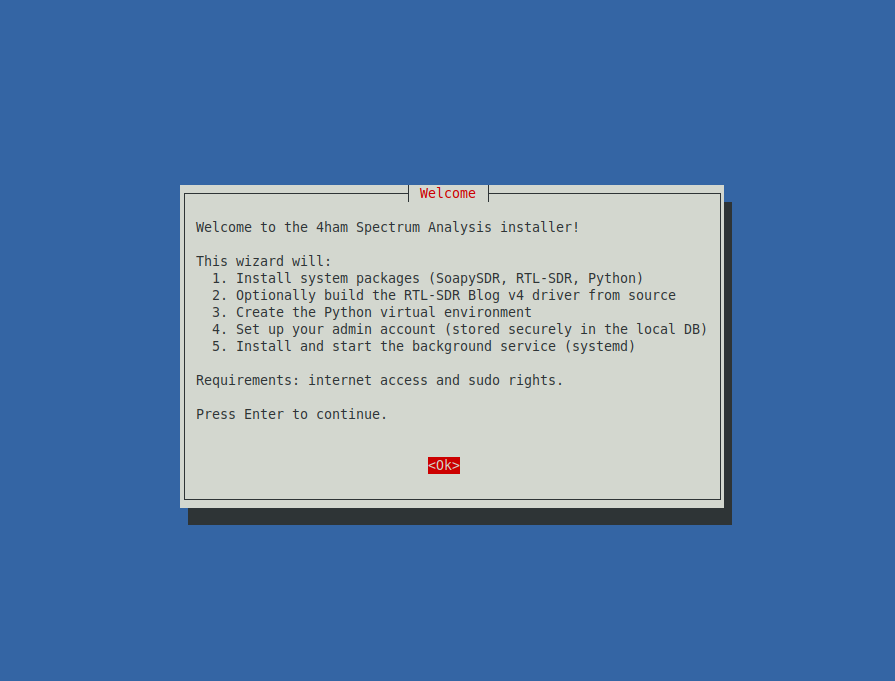
*Graphical installer — interactive whiptail TUI*

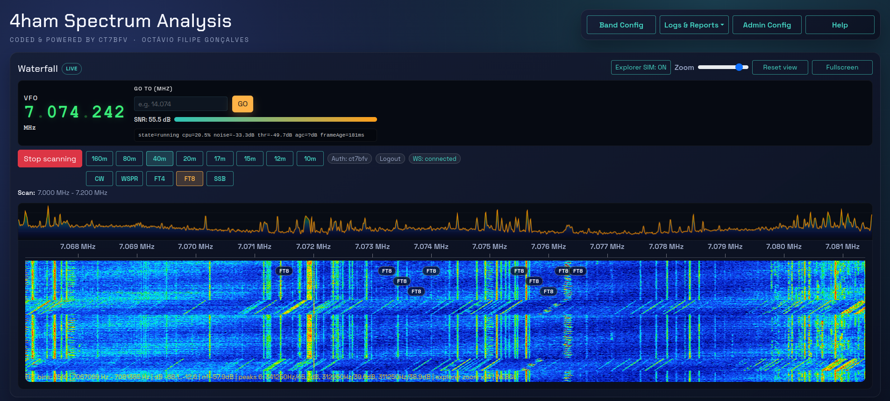
*Main panel — VFO, band and mode selection, live waterfall with FT8 markers*

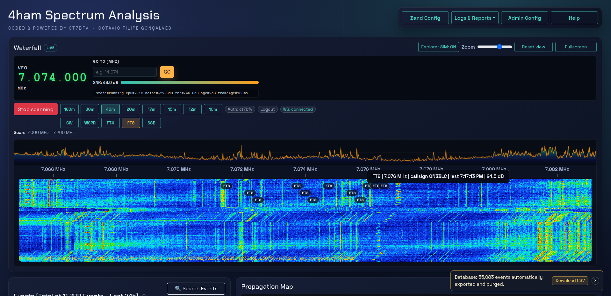
*FT8 marker tooltip on mouse hover*

| | |
|:---:|:---:|
| 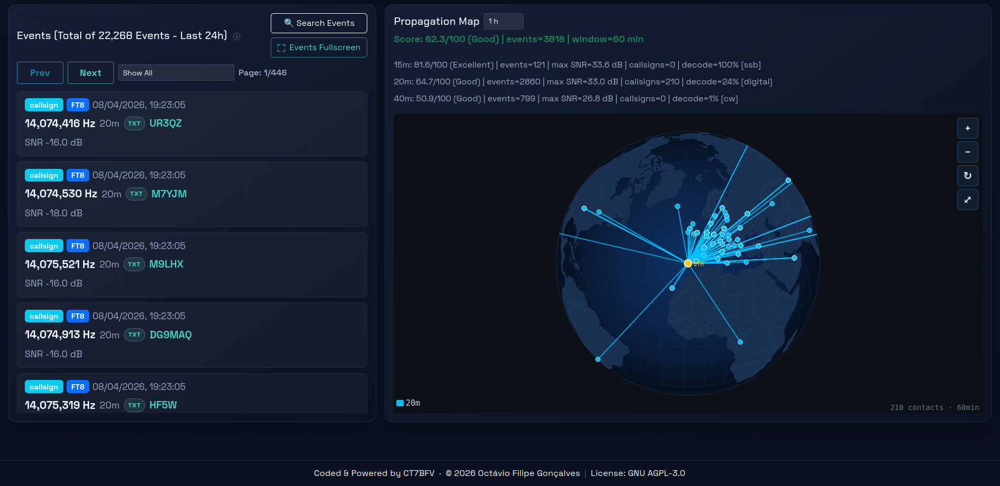 | 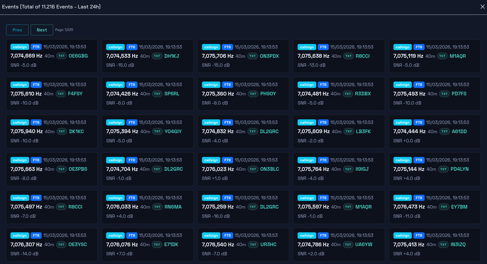 |
| *Propagation map and forecasts* | *Events panel — fullscreen view* |
| 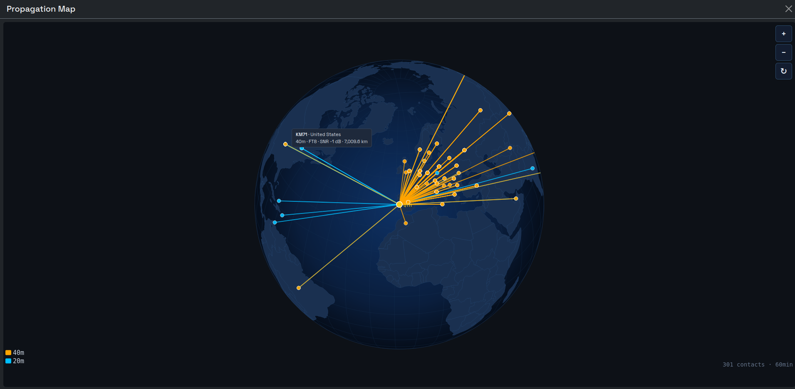 | 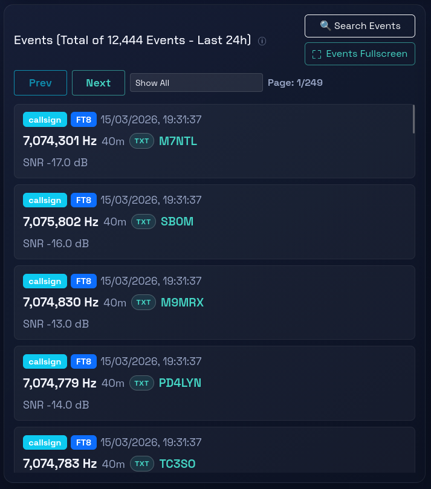 |
| *Propagation map — fullscreen* | *Events card* |

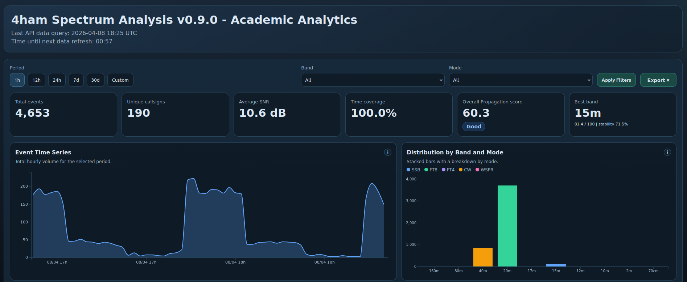
*Academic Analytics — propagation scoring, band heatmap, and KPIs*

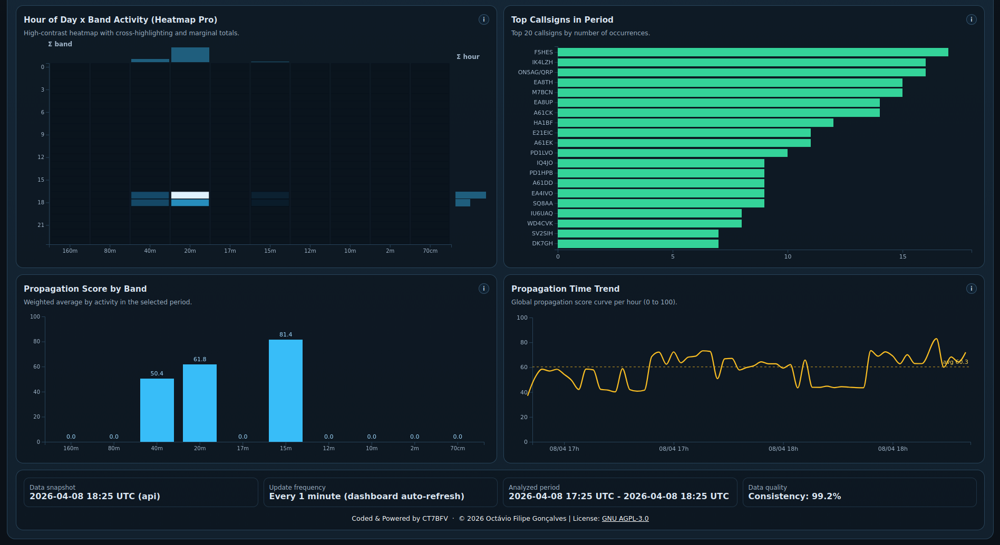
*Academic Analytics — charts, top callsigns, and export options*

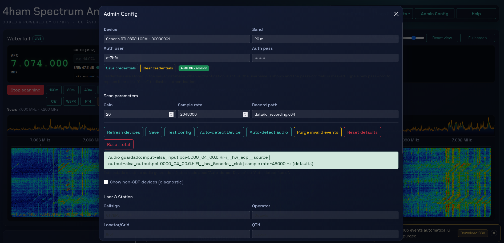
*Administration — configuration modal*

## Quick Start

Clone the repository and run the automatic installer — it handles everything:

```bash
git clone https://github.com/octaviofilipepereira/4ham-spectrum-analysis.git
cd 4ham-spectrum-analysis
./install.sh
```

The installer presents a **graphical interactive wizard** (whiptail TUI) that guides you through:
- Installing all system packages (SoapySDR, RTL-SDR, Python, build tools)
- Optionally building the RTL-SDR Blog v4 driver from source (asked during setup)
- Optionally installing OpenAI Whisper for SSB voice transcription (asked during setup — ~700 MB download)
- Creating the Python virtual environment and installing all dependencies
- Setting up your admin account (username + password — stored as bcrypt in the local database)
- Installing and starting the systemd background service (auto-start on boot)

At the end, **open the URL shown on screen in your browser and log in**. That's it.

Default frontend routes:
- Main operating UI: `/`
- Academic analytics dashboard: `/4ham_academic_analytics.html`

> For full manual installation notes and decoder setup, see [docs/install.md](docs/install.md) and [docs/installation_manual.md](docs/installation_manual.md).

## Uninstall (quick)

```bash
./uninstall.sh
./uninstall.sh --purge-data
./uninstall.sh --purge-system-packages
./uninstall.sh --purge-all --yes
```

## Changelog (cumulative)

### v0.12.3
- **Preset Scheduler**: time-of-day automatic rotation of scan presets. 6 new API endpoints, `preset_schedules` DB table, background scheduler task (30 s tick).
- **Scheduler auto-start on boot**: resumes automatically after server restart if enabled schedules exist.
- **Rotation recovery**: scheduler re-applies preset within 30 s if rotation stops unexpectedly.
- **Schedule overlap validation**: HTTP 409 on colliding time windows (same-day and cross-midnight).
- **Frontend**: Preset Scheduler section in Rotation Presets modal — CRUD schedules, start/stop, UTC clock, sorted table.
- **Academic Analytics export enrichment**: the "All Events" sheet (XLSX) and CSV export now include 13 additional fields per event — DXCC entity name, continent, DXCC code, latitude, longitude, power (dBm), confidence, crest (dB), Doppler shift (Hz), source, grid locator, derived band, and normalised mode.
- **Human-readable export column headers**: all export column headers now use descriptive names with measurement units (e.g. "Frequency (Hz)", "SNR (dB)", "Power (dBm)") instead of internal snake_case identifiers.

### v0.12.2
- **SNR KPI split**: separate "Avg SNR FT4/FT8/WSPR" and "Avg SNR CW/SSB" cards (incompatible measurement scales).
- **Removed Time Coverage KPI card**, renamed "Overall Propagation score" → "Global Propagation".
- **Documentation**: embedding Academic Dashboard on external websites (Apache+PHP, Nginx).

### v0.12.1
- **QTH-Centric Propagation Map redesign**: DR2W-style irregular solar-shaped propagation zones per band — 3 intensity layers (Strong / Moderate / Fringe) shaped by solar elevation, with day/night terminator and dark-hemisphere overlay.
- **NOAA SWPC Ionospheric Space Weather sidebar**: real-time SFI, Kp, foF2, and per-band status pills (Open / Marginal / Closed / Absorbed). Auto-refresh every 15 minutes.
- **Backend ionospheric model** (`/api/map/ionospheric`): foF2 = 3.5 + 0.6 × √SSN (ionosonde-calibrated, 45 % night floor); SSN-dependent D-layer absorption; multi-hop skip model (2 500 km/hop, max 4 hops); NVIS cap for bands < 8 MHz; band status re-evaluated after absorption.
- **Map layout**: 3/4-width globe + 1/4-width ionospheric sidebar.
- **Map controls**: Ctrl+Mouse Wheel zoom, drag to rotate, double-click reset; zoom + rotation persisted via `sessionStorage`.
- **Band buttons**: vertical, toggle per-band, persisted via `sessionStorage`, none selected by default.
- **Split legend**: contacts + counts (left), zone intensity swatches (right).
- **Documentation**: new propagation map and ionospheric sidebar chapters in `help.html`, user manuals (EN/PT), and README.

### v0.11.1
- **SQLite concurrency fix**: eliminated ~705 `sqlite3.InterfaceError`/day in auth/session methods. CPU 243%→37%, memory 1.63 GB→580 MB.
- **SSB signal quality hardening**: 60 s debounce + SNR ≥ 8 dB gate, BW cap 2800 Hz across 4 filtering points, phantom SSB event elimination.
- **Focus hold improvement**: `hold_ms` 15→10 s, auto formula `span÷15k`, max 16.
- **Roadmap bilingual audit**: 15+ inaccuracies corrected (EN/PT).

### v0.10.0
- **Scan Rotation**: automated multi-band/mode rotation with configurable dwell, loop, live countdown status bar. Rotation presets (save/load/delete) for quick multi-band schedule recall.
- **Per-band×mode phantom mode elimination**: two-layer fix — occupancy events forced to match active decoder mode (prevents heuristic mis-classification), and confirmed_band_modes filter time-scoped to analysed period (prevents historical sessions from polluting charts).
- **UTC fix for custom dates**: frontend custom date inputs now forced to UTC interpretation, preventing off-by-one-day boundary errors in non-UTC timezones.
- **OS compatibility documentation**: all docs now list exact supported distributions (Ubuntu 20.04+, Debian 11+, Linux Mint 20+, Raspberry Pi OS 11+).
- **Propagation scoring reference v1.2**: exact mathematical formulas, verification penalty, complete SNR parameters table (15 modes), cross-referenced in all manuals.
- **Comprehensive Academic Analytics documentation**: full interpretation guide, export walkthrough, and KPI reference in help.html and user manuals (PT/EN).

### v0.9.0
- **3-formula propagation scoring**: separate Digital/CW/SSB formulas with tailored SNR normalisation. Server-computed scores.
- **Export multi-format**: CSV, XLSX (Aggregated + All Events), and JSON export from Academic Analytics.
- **Propagation map time window**: selectable 1h / 2h / 4h / 8h / 24h filter on the propagation globe.
- **1 h / 12 h presets**: short-period options with minute-level bucketing for higher resolution.
- **Loading overlay**: spinner shown while switching periods or applying filters.
- **Callsign ITU validation**: two-branch regex rejects invalid callsigns (e.g. "5I5I").
- **Comprehensive Academic Analytics documentation**: full chapter in PT/EN manuals and help.html — purpose, KPI interpretation, chart-by-chart guide, step-by-step export, metadata footer.
- **Propagation scoring reference docs**: EN + PT with formulas, constants, implementation tables, and PDF exports.
- **Frontend bug fixes**: CW_TRAFFIC in CW_MODES, FST4W/Q65/VOICE_DETECTION in SNR_PARAMS, verification threshold >5.
- **Immediate preset switching**, **preset persistence**, **top 20 callsigns**, **Heatmap Pro improvements**.

### v0.8.7
- **Desktop launcher shortcut**: installer offers an optional desktop shortcut on graphical systems. Double-click opens an interactive terminal menu (Start / Stop / Restart Server, Open Dashboard). Works on GNOME, Cinnamon, XFCE, KDE, MATE, LXQt. Uninstaller removes the shortcut.
- **Installer Whisper model choice**: choose between `tiny`, `base`, or `small` Whisper models during installation, with pros/cons for each.
- **RTL-SDR v4 install fix**: reinstalls SoapySDR Python module and properly blacklists `rtl2832_sdr` kernel module.
- **Decoder Status UI**: shows Configured / Running / Stopped for each decoder instead of just Disabled.
- **Academic Analytics fix**: `SSB_TRAFFIC` and `CW_CANDIDATE` events now included in all analytics charts and propagation calculations.
- **Check for Updates**: new button in Admin Config performs `git fetch/pull` and auto-restarts the server.
- **Admin Config layout**: Purge / Reset defaults / Reset total moved to a second button row; all buttons documented in help.
- **RTL-SDR hotplug**: Refresh Devices button applies correct gain and sample rate when an RTL-SDR is detected.

### v0.8.5
- **Academic Analytics dashboard**: new page with activity timeline, band distribution, Heatmap Pro (hour × band), and propagation map. Accessible via the **Data Analysis** toolbar button or `/4ham_academic_analytics.html`. Backend endpoint `/api/analytics/academic`. Auto-refresh every 60 s.
- **Data Analysis toolbar button**: opens the analytics dashboard in a new tab (positioned before Help).
- **Environment file moved to `.env`**: service env file now lives at `<project>/.env` instead of `/etc/default/4ham-spectrum-analysis` — no sudo required.
- **html2canvas local**: replaced last CDN dependency with a local copy — zero external CDN calls.
- **Version endpoint**: `/api/version` returns the running version.

### v0.8.4
- **VOICE DETECTED marker flood fix**: switching modes (CW → SSB) no longer floods the waterfall with historical markers. Markers now use original event timestamps instead of `Date.now()`, ensuring correct TTL expiration. Backend `voice_marker_cache` cleared on scan stop. Frontend `decodedMarkerCache` cleared on mode switch.
- **Events card sync on mode switch**: Events panel now immediately reloads with the correct mode's events after switching modes.
- **SSB Traffic spam reduced**: debounce 8 s → 30 s, SNR gate added (rejects below threshold), SSB_VOICE markers only on ASR-confirmed voice.
- **libuhd crash protection**: `SoapySDR.Device.enumerate()` runs in a subprocess to survive SIGSEGV from `libuhd.so`.
- **Waterfall tooltip "last" field fix**: added fallback for empty timestamp in marker tooltips.
- **Decoder Status modal**: now shows all active decoders (CW, SSB/ASR, PSK) with running/stopped status. Internal FT row removed (redundant). PSK shows "Not available" (not yet implemented). SSB queue depth hidden when 0.
- **Documentation**: SSB Max Holds parameter documented in help and user manual; `uninstall.sh` and `server_control.sh` documented in install guides.

### v0.8.3
- **VOICE DETECTED waterfall markers**: SSB Voice Signature events now produce real-time markers on the waterfall overlay, labeled "VOICE DETECTED" with a distinctive black-and-gold style (45 s TTL). Injected from both the occupancy detector and the ASR/Whisper pipeline.
- **Mode-filtered event fetch**: switching modes (SSB → CW → SSB) no longer loses events — the frontend sends the active mode filter to the API so the 200-event limit returns only relevant results.
- **ASR startup fix**: ASR configuration is now restored from the database at application startup, preventing a crash when the scan resumes with ASR enabled.
- **Marker thresholds**: `MARKER_MIN_SNR_DB` lowered 10 → 8 dB; `MARKER_MAX_AGE_S` raised 10 → 30 s for better SSB sensitivity.

### v0.8.2
- **SSB ASR pipeline activation**: `parse_ssb_asr_text()` wired into the live SSB event pipeline — Whisper transcripts are now parsed for callsigns (direct and NATO phonetic) in real time.
- **SSB event labels**: events now show **Voice Confirmed** (voice only), **Voice Transcript** (has transcript, no callsign), or the **resolved callsign** — replaces the old generic "NO CALLSIGN DETECTED".
- **TXT button & tooltip**: every SSB event shows a TXT button with decoded text (transcript or spectral proof). Tooltip uses a fixed overlay that works inside modals and overflow-clipped panels.

### v0.8.1
- **SDR enumerate segfault fix**: `SoapySDR.Device.enumerate()` was called on every HTTP request, occasionally triggering a segfault in `libuhd.so` on unstable USB hardware. Added a 30 s TTL cache in `SDRController` — reduces native USB calls and returns stale cache on failure.
- **SSB threshold fixes**: `focus_hits` default mismatch (1 vs 2), SNR threshold lowered 10→8 dB, hardcoded `max(2,...)` in spectrum pipeline removed, frontend marker TTL raised 15→20 s.

### v0.8.0
- **SSB Voice Signature Detection**: real-time SSB voice demodulation with VAD and Whisper ASR transcription.
- **SSB event labels**: SSB events display as "Voice Confirmed" (voice only), "Voice Transcript" (has ASR text), or the resolved callsign.
- **Whisper ASR integration**: optional OpenAI Whisper model (tiny/base) for real-time speech-to-text on SSB segments; asked during `./install.sh` setup.
- **HF mode classification fix**: signals below 30 MHz no longer misclassified as AM; bandwidth-based AM is reclassified to SSB on HF bands (except 10 m AM window 29.0–29.7 MHz).
- **Occupancy flood protection**: per-frequency rate limiter (5 kHz buckets, 10 s cooldown; 3 s for digital modes) prevents DB/WebSocket flood from broadband noise during scanning.
- **Events card cleanup**: "Show All" filter now presents only callsign-type events (FT8/FT4, CW, APRS, Voice Signature); new "All + Occupancy (raw)" option for advanced users who need raw detections.
- **Propagation map**: score and band activity moved above the globe for immediate visibility.

### v0.7.1
- Graphical installer (`install.sh`) — interactive whiptail TUI for end-to-end setup: system packages, optional RTL-SDR Blog v4 driver, Python venv, admin account (bcrypt/SQLite), systemd service. Single command to go from `git clone` to running application.

### v0.6.0
- Added session-based authentication backed by SQLite credentials, with `/api/auth/status`, login, logout, and cookie session validation across reloads and WebSocket streams.
- Fixed the browser auth-popup problem by removing `WWW-Authenticate` challenges from the in-app auth flow.
- Corrected the CW decoder segment for 20 m to `14.000-14.070 MHz` while keeping the 20 m scan band at `14.000-14.350 MHz`.
- Added a scan context summary in the UI so operators can see both the scan band and the active CW decoder subsegment.

### v0.5.0
- Complete CW Morse decoder in pure Python (Butterworth filter, Hilbert envelope, auto-threshold, timing analysis, Morse table lookup).
- CWSweepDecoder for FFT-guided band sweep with configurable step/dwell.
- CW decoder integrated into API with auto-start, mutual exclusion with FT decoders.
- CW sweep controls in frontend scan panel; CW markers on waterfall.
- RTL-SDR V4 detection and HF handling (R828D upconverter, no direct sampling).
- WSPR dial frequencies corrected for IARU Region 1; WSPR OOM and mid-scan abort fixes.
- Improved UI layout: larger VFO, status in VFO bar, vibrant band lines, fixed layout shifts.
- Propagation map polish: drag speed reduced, globe fills card, larger control buttons.
- Preview scan bounds configurable via env vars; stale bounds cleared on stop.
- Added scipy to requirements.txt.

### v0.2.6
- Added waterfall mode-label hover tooltip with frequency, latest callsign, last-seen time, and SNR.
- Callsign in tooltip is resolved by nearest frequency match in cache; when no local match exists, it falls back to the most recent detected callsign.
- Improved operator feedback with immediate custom tooltip rendering on hover.

### v0.2.5
- Removed Fake waterfall mode from the UI and runtime flow; waterfall now runs in LIVE mode only.
- Replaced simulated waterfall fallback with a clear generic status message when live spectrum frames are unavailable.
- Improved waterfall no-data communication with a larger, centered, high-visibility message for operators.

### v0.2.4
- Added quick band switching row near Start scanning for faster operator workflow.
- Implemented live band switching with automatic stop/start while scan is running.
- Improved scan startup resilience with sample-rate safeguards and clearer error behavior.
- Added operational tooling with `server_control.sh` (`start|stop|restart|status|logs`).
- Added production `systemd` packaging tooling and service management scripts.

### v0.2.3
- Refined Administration UX for device/audio setup workflows.
- Improved reliability when auto-detect fills and persists device configuration fields.
- Added dedicated save actions in Administration for device and audio configuration blocks.
- Removed duplicated audio status messaging in the Audio Configuration area.

### v0.2.2
- Added global fullscreen toggle for waterfall visualization.
- Improved fullscreen button label behavior for clearer UI state.

### v0.2.1
- Added LIVE/FAKE waterfall mode badge and improved decoder status hints.
- Improved events rendering to better infer and present band/mode details.
- Added richer SSB event enrichment and grid/report display consistency.

Releases: [v0.2.1](https://github.com/octaviofilipepereira/4ham-spectrum-analysis/releases/tag/v0.2.1), [v0.2.2](https://github.com/octaviofilipepereira/4ham-spectrum-analysis/releases/tag/v0.2.2), [v0.2.3](https://github.com/octaviofilipepereira/4ham-spectrum-analysis/releases/tag/v0.2.3), [v0.2.4](https://github.com/octaviofilipepereira/4ham-spectrum-analysis/releases/tag/v0.2.4)

## Target bands
- 2 m
- 70 cm
- 10 m
- 12 m
- 15 m
- 17 m
- 20 m
- 40 m
- 80 m
- 160 m

## Target bands (IARU Region 1 - band limits)
- 160 m: 1.810 - 2.000 MHz
- 80 m: 3.500 - 3.800 MHz
- 40 m: 7.000 - 7.200 MHz
- 20 m: 14.000 - 14.350 MHz
- 17 m: 18.068 - 18.168 MHz
- 15 m: 21.000 - 21.450 MHz
- 12 m: 24.890 - 24.990 MHz
- 10 m: 28.000 - 29.700 MHz
- 2 m: 144 - 146 MHz
- 70 cm: 430 - 440 MHz

Note: limits may vary by national regulation; the plan supports per-country profiles.
Regional profile example: see [config/region_profile_example.yaml](config/region_profile_example.yaml).
Regional profile schema: see [config/region_profile.schema.json](config/region_profile.schema.json).

## Architecture (high level)
1. **SDR Layer**
	- Device control (tuning, gain, sample rate).
	- Driver abstraction (SoapySDR or native backends).
2. **DSP Layer**
	- FFT, windowing, noise floor, peak detection.
	- Bandwidth and occupancy estimation.
3. **Identification Layer**
	- Mode classification (CW/FSK/PSK/SSB/AM/FM) with HF-aware heuristics.
	- Digital decoding (FT8/FT4/WSPR, APRS) and CW.
	- SSB Voice Signature detection (VAD + Whisper ASR).
4. **Backend API**
	- REST + WebSocket for spectrum and event streaming.
5. **Web Frontend**
	- Real-time waterfall, scan controls, logs, export.
6. **Persistence**
	- SQLite for history, events, and settings.

## Stack
- **Backend/DSP**: Python + SoapySDR + NumPy/SciPy.
- **API**: FastAPI (REST + WebSocket).
- **Frontend**: Vanilla JavaScript + Bootstrap 5, 2D Canvas for waterfall.
- **Storage**: SQLite + files for export (CSV/JSON).

Backend skeleton: see [backend/app/main.py](backend/app/main.py).
Frontend skeleton: see [frontend/index.html](frontend/index.html).

## Data flow
1. SDR captures IQ by frequency segments (scan).
2. DSP generates FFT and per-bin energy.
3. Occupancy detection applies adaptive threshold.
4. Results and waterfall are sent over WebSocket.
5. UI updates in real time and stores history.

## Suggested modules
- `sdr_controller`: hardware discovery, tuning, gain.
- `scan_engine`: per-band scanning (step/dwell).
- `dsp_pipeline`: FFT, peak detection, occupancy.
- `signal_classifier`: mode heuristics.
- `digital_decoder`: integration with digital decoders.
- `cw_decoder`: CW detection and decoding.
- `api_gateway`: REST + WebSocket.
- `ui`: waterfall, controls, logs.
- `storage`: events and history.

## Callsign identification (design)
- FT8/FT4: integration via `jt9` (direct subprocess on WAV cycles), extract callsigns and SNR.
- APRS: Direwolf as TNC, read via KISS TCP/AGW, extract callsigns and messages.
- CW: tone detection, adaptive binarization, Morse decoder, timing correction.
- SSB (voice): VAD + ASR to suggest callsigns (complex pipeline, lower confidence).

Note: backend supports automated file ingestion (ALL.TXT/logs) via environment variables; see the full manual.

## Technical decoder pipelines
### FT8 / FT4 (jt9)
1. Capture IQ and tune to the FT8/FT4 segment of the band.
2. Downconvert + band filters + gain adjustment.
3. Write audio to WAV file (15-second cycle for FT8, 7.5 s for FT4).
4. Run `jt9` decoder subprocess on the WAV file.
5. Parse decoded text output: callsigns, SNR, DF, time, and frequency.
6. Emit identification events with high confidence.

### APRS (Direwolf)
1. Capture IQ and tune to APRS frequency (e.g., 144.800 MHz in Region 1).
2. FM demodulation and audio filtering (AFSK 1200).
3. Route audio to Direwolf (virtual audio or stdin).
4. Read frames via KISS TCP/AGW.
5. Parse AX.25: callsign, path, payload, position.
6. Emit APRS events and attach messages/telemetry.

### CW (Morse)
1. Capture IQ and detect narrow peak (CW carrier).
2. Demodulation (BFO) and narrow band-pass filter.
3. Envelope + adaptive binarization (AGC + threshold).
4. Dit/dah detection with WPM estimation.
5. Morse decoder with timing correction.
6. Emit callsign events with medium confidence.

### SSB (voice)
1. Capture IQ and detect occupancy in typical SSB bandwidth.
2. SSB demodulation (USB/LSB) and voice filtering.
3. VAD (voice activity detection) for segmentation.
4. ASR with callsign vocabulary and phonetic alphabet.
5. Normalize callsign, score/confidence.
6. Emit events with low/medium confidence.

## ASR pipeline for SSB (detailed)
1. **Audio pre-processing**: 3 kHz BW, level normalization, light denoise.
2. **VAD**: speech segmentation (e.g., WebRTC VAD) to reduce cost.
3. **Light ASR**: edge-friendly model (e.g., Vosk/Kaldi) or Whisper tiny/base on PC.
4. **Controlled vocabulary**:
	- Callsigns (regex and dynamic per-country dictionary).
	- Phonetic alphabet (NATO/ICAO) and numbers.
	- Common calling words (CQ, QRZ, de, portable, mobile).
5. **Post-processing**:
	- Parse phonetic sequences (e.g., "Charlie Tango One" -> CT1).
	- Validate with callsign regex (IARU/country).
	- Combined final score (ASR confidence + regex consistency).
6. **Event emission**:
	- `callsign` with low/medium `confidence`.
	- `raw` with original transcript.

Note: accuracy varies significantly with noise and accent; treat ASR as a suggestion.

## ASR: recommended models by hardware
- **Raspberry Pi 4 (4 GB)**: Vosk (pt/en/es) with small models; moderate latency.
- **Raspberry Pi 5 (8 GB)**: Vosk + grammars; Whisper tiny with light workloads.
- **Dual-core PC**: Whisper base/small or larger Vosk models.
- **GPU PC**: Whisper medium/large, better for noise and accents.

Note: controlled vocabulary and rescoring improve callsign hit rate.

## Callsigns: regex and normalization (baseline)
- **Global regex (simplified)**: `\b[A-Z]{1,3}\d{1,4}[A-Z]{1,3}(/P|/M|/MM|/QRP|/QRPP)?\b`
- **Normalization**:
	- Uppercase.
	- Remove separators/noise (e.g., "CT 1 ABC" -> CT1ABC).
	- Map phonetics to letters (e.g., "Charlie Tango One" -> CT1).
	- Preserve operational suffixes (/P, /M, /MM, /QRP).
- **Regional validation**:
	- Per-country table (prefixes and formats) to reduce false positives.
	- IARU Region 1 as default profile.

Note: formats vary by country; create prefix tables per national regulator.

## Diagram (components and flow)
SDR (RTL-SDR/HackRF/Airspy/Transceiver)
	-> sdr_controller
	-> scan_engine
	-> dsp_pipeline (FFT/occupancy)
	-> signal_classifier
	-> decoders (FT8/FT4 | APRS | CW | SSB)
	-> event_bus
	-> api_gateway (REST/WS)
	-> frontend (waterfall/UI)
	-> storage (SQLite/exports)

### Mermaid
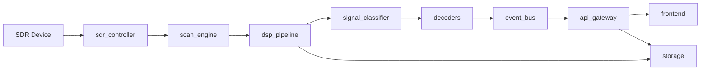

## Event/telemetry format
JSON schema: see [events.schema.json](events.schema.json).
Per-mode contract: see [docs/events_contract.md](docs/events_contract.md).

### Base event
```json
{
	"type": "occupancy|callsign",
	"timestamp": "2026-02-20T12:34:56Z",
	"band": "20m",
	"frequency_hz": 14074000,
	"mode": "FT8|FT4|APRS|CW|SSB|Unknown",
	"snr_db": -12.5,
	"confidence": 0.0,
	"source": "wsjtx|direwolf|cw|asr|dsp",
	"device": "rtl_sdr"
}
```

### Occupancy event
```json
{
	"type": "occupancy",
	"timestamp": "2026-02-20T12:34:56Z",
	"band": "40m",
	"frequency_hz": 7074000,
	"bandwidth_hz": 2700,
	"power_dbm": -92.3,
	"snr_db": 6.1,
	"threshold_dbm": -98.0,
	"occupied": true,
	"mode": "SSB",
	"confidence": 0.62,
	"device": "rtl_sdr"
}
```

### Identification event (callsign)
```json
{
	"type": "callsign",
	"timestamp": "2026-02-20T12:34:56Z",
	"band": "20m",
	"frequency_hz": 14074000,
	"mode": "FT8",
	"callsign": "CT1ABC",
	"snr_db": -12.5,
	"df_hz": 42,
	"confidence": 0.94,
	"raw": "CT1ABC EA1XYZ IO81",
	"source": "wsjtx",
	"device": "rtl_sdr"
}
```

## API contract (REST/WS)
### REST (JSON)
- `GET /api/health`: service and device status.
- `GET /api/devices`: list of available SDR devices.
- `POST /api/scan/start`: start scan (inline `scan` payload or `scan_config_path` for YAML/JSON; optional `region_profile_path` to resolve per-band limits).
- `POST /api/scan/stop`: stop scan.
- `GET /api/bands`: configured bands and limits.
- `GET /api/events`: filtered history (time range, band, mode, callsign).
- `GET /api/exports/{id}`: CSV/JSON/PNG download.

### WebSocket
- `WS /ws/spectrum`: FFT/waterfall stream (aggregated frames).
- `WS /ws/events`: real-time occupancy and callsign events.
- `WS /ws/status`: scan state and processing statistics.
	- Includes per-band noise floor when available.

### Authentication (optional)
- **Primary method**: session-based login with SQLite-stored credentials (bcrypt hashed). Admin account is created during `./install.sh` setup.
- Endpoints: `/api/auth/login`, `/api/auth/logout`, `/api/auth/status`.
- Session cookie with 24-hour expiration; validated across page reloads and WebSocket streams.
- **Fallback**: set `BASIC_AUTH_USER` and `BASIC_AUTH_PASS` environment variables for simple Basic Auth.

### Main payloads
Scan schema: see [config/scan_config.schema.json](config/scan_config.schema.json).
```json
{
	"scan": {
		"band": "20m",
		"start_hz": 14000000,
		"end_hz": 14350000,
		"step_hz": 2000,
		"dwell_ms": 250,
		"mode": "auto",
		"record_path": "data/iq_recording.c64"
	}
}
```

```json
{
	"spectrum_frame": {
		"timestamp": "2026-02-20T12:34:56Z",
		"center_hz": 14074000,
		"span_hz": 3000,
		"fft_db": [-120.1, -118.2, -116.7],
		"bin_hz": 3.9
	}
}
```

```json
{
	"status": {
		"state": "running",
		"device": "rtl_sdr",
		"cpu_pct": 62.5,
		"drop_rate_pct": 0.4
	}
}
```

## WebSocket: frame details and rates
Detailed specification: see [docs/websocket_spec.md](docs/websocket_spec.md).
- `WS /ws/spectrum`: sends aggregated frames (e.g., 10 to 20 FFTs per message).
- `spectrum_frame` supports optional compression (delta + int8) for Raspberry Pi.
- Suggested rates:
  - Waterfall: 5 to 15 fps (adjustable).
  - Events: real-time (latency < 500 ms).
  - Status: 1 to 2 Hz.

### Compressed frame (example)
```json
{
	"spectrum_frame": {
		"timestamp": "2026-02-20T12:34:56Z",
		"center_hz": 7074000,
		"span_hz": 3000,
		"bin_hz": 3.9,
		"encoding": "delta_int8",
		"fft_ref_db": -120.0,
		"fft_delta": [0, 1, 0, -1]
	}
}
```

## Decoder integration (minimum configuration)
### jt9 (FT8/FT4)
- `jt9` binary must be installed (`apt install wsjtx` or built from source).
- No GUI or virtual audio required — `jt9` is called directly on WAV files.
- Sync time (NTP) to avoid decode losses (critical for FT8/FT4 timing cycles).

### Direwolf (APRS)
- FM demodulation -> 1200 AFSK audio.
- Direwolf in KISS TCP mode (configurable port).
- Parse AX.25 frames with CRC validation.
- Region 1 APRS frequency: 144.800 MHz (country-configurable).

## Roadmap
### Completed milestones
- [x] MVP: scan + occupancy + waterfall + export.
- [x] Analog mode identification (heuristic classifier).
- [x] Digital decoding pipeline (FT8/FT4/APRS/CW) and SSB ASR baseline.
- [x] API/WebSocket streaming, compression, storage exports, and QA/Ops baseline.
- [x] SSB Voice Signature detection (v0.8.0): real-time VAD + Whisper ASR, Voice Signature badge, occupancy flood protection.
- [x] 3-formula propagation scoring (v0.9.0): Digital/CW/SSB formulas, mode-specific SNR normalisation, academic analytics.
- [x] Scan Rotation (v0.10.0): automated multi-band/mode cycling with configurable dwell, live status, and rotation presets (save/load/delete).
- [x] Production stabilisation (v0.11.1): SQLite concurrency fix, SSB signal hardening.

### Next milestones
1. Multi-node aggregation (multiple receivers feeding one backend).
2. Advanced SSB ASR (model profiles, confidence calibration, noise robustness, transceiver audio sources).
3. Deployment hardening (service templates + operational monitoring/retention defaults).

## System requirements

Full hardware and performance details: see [docs/hardware_requirements.md](docs/hardware_requirements.md).

### Operating system
- **Linux** (Ubuntu 20.04+ / Debian 11+ / Linux Mint 20+ / Raspberry Pi OS 11+) — primary and recommended.
- **Windows 10/11**: supported via WSL2 or native Python; SoapySDR driver support varies.
- **Python**: 3.10 or later.
- **Browser**: any modern browser (Chrome, Firefox, Edge) to access the web UI.

### Hardware — minimum by scenario

| | **Without ASR** | **With Whisper ASR** |
|---|---|---|
| **CPU** | 2 cores (RPi 4 or x86) | 4 cores x86 |
| **RAM** | 2 GB | 4 GB |
| **Disk** | 2 GB free | 10 GB free |
| **USB** | 1 x USB 2.0 | 1 x USB 2.0 |

### SDR devices
- **Primary**: RTL-SDR Blog v3 / v4 (via SoapySDR).
- **Supported**: HackRF, Airspy, and any SoapySDR-compatible device.
- **Planned**: transceiver SDR interfaces (FT-991A, IC-7300 via CAT/audio).

### Disk breakdown
- Python venv (without Whisper): ~500 MB.
- Python venv (with Whisper + PyTorch/CUDA): ~7.3 GB.
- SQLite database at 500k events (configured limit): ~100 MB.
- Logs with rotation (10 MB x 5 backups): ~50 MB max.
- IQ recording (configurable limit): up to 512 MB.

### Measured resource usage (v0.8.0, active scan)
- **RAM (RSS)**: ~640 MB with scan + FFT + decoders running.
- **CPU**: ~30% of one core during continuous HF scan.
- **Database**: ~5 MB at 25k events.

### Platform guidance
- **Raspberry Pi 4 (4 GB)**: scan + FT8/FT4 + APRS + CW — no Whisper ASR.
- **Raspberry Pi 5 (8 GB)**: adds light Whisper (tiny/base model, CPU only).
- **PC (4+ cores, 4 GB+)**: all decoders including Whisper at moderate scan rates.
- **GPU PC**: Whisper medium/large models for better noise/accent handling.

### Network and time
- Local access via browser (default: `http://localhost:8000`).
- **NTP strongly recommended** for FT8/FT4 decode accuracy (timing-critical modes).
- Optional remote access requires network hardening (see [docs/security.md](docs/security.md)).

### Performance tips
- Raspberry Pi: limit sample rate, batch FFT processing.
- Use compression/downsampling for efficient WebSocket streaming.
- Disable Whisper ASR on memory-constrained systems to save ~1.5 GB RAM.
- Stop unnecessary system services (databases, IDEs) on dedicated stations.

## Next steps
- Detail hardware-specific settings (RTL-SDR/HackRF/Airspy/transceiver).
- Add multi-node aggregation support (multiple receivers feeding one backend).
- Improve SSB ASR confidence calibration for noisy channels and transceiver audio sources (FT-991A/IC-7300).
- Add packaged operational defaults (retention, log rotation, service health checks).

## References
- Installation: see [docs/install.md](docs/install.md).
- SQLite schema: see [docs/sqlite_schema.sql](docs/sqlite_schema.sql).
- Propagation scoring (EN): see [docs/propagation_scoring_reference.md](docs/propagation_scoring_reference.md).
- Propagation scoring (PT): see [docs/propagation_scoring_reference_pt.md](docs/propagation_scoring_reference_pt.md).
- Prefix validation: see [docs/prefix_validation.md](docs/prefix_validation.md).
- Basic DSP tests: see [backend/tests/test_dsp.py](backend/tests/test_dsp.py).
- Server control: see [scripts/server_control.sh](scripts/server_control.sh).
